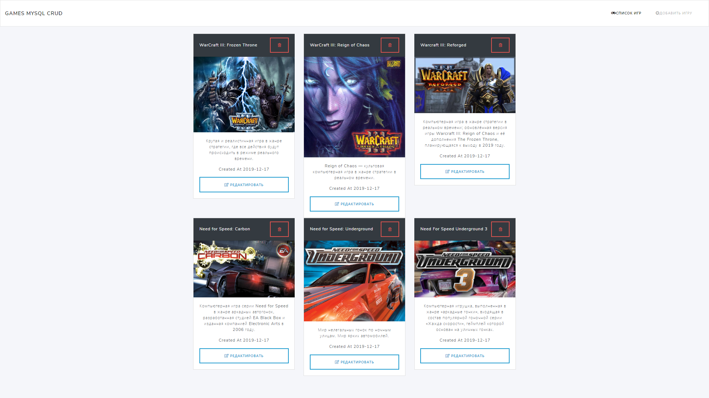

Приложение демонстрирует работу на основе CRUD опрераций 
используя Angular 7, Nodejs и базу данных MySQL. 
В этом приложении я создал собственный REST API, 
используя Nodejs (используется: Express, Promise-MySQL, CORS, Morgan)  
вместе с Typescript, а затем используем его вместе с клиентским приложением 
на Angular 7.
# Screenshot

